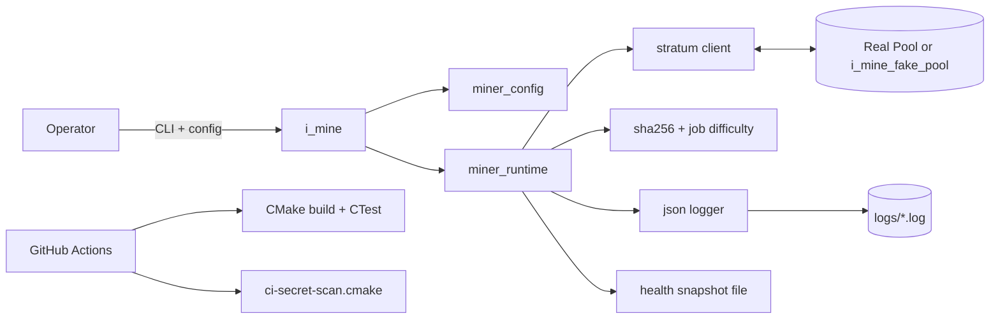

# Enterprise Readiness Report

Date: 2026-07-31  
Repository: i_mine

This report is based on direct inspection of source, configs, docs, scripts, and CI workflows, plus build/test verification.

---

## PHASE 1 - Repository Discovery

### System Inventory

- Runtime executables
	- i_mine: standalone miner entrypoint and lifecycle orchestration.
	- i_mine_fake_pool: local deterministic Stratum simulator for offline integration.
- Core library modules
	- miner_cli: CLI parse/override contract.
	- miner_config: JSON parsing, validation, environment secret override.
	- miner_runtime: worker loop, Stratum session loop, reconnect behavior, shutdown/readiness reporting.
	- stratum: socket client, JSON-RPC request/response and notify handling.
	- logger: JSON-line logging with sensitive field redaction.
	- job + sha256: difficulty checks and hashing.
- Build and automation
	- CMake targets for build, local quality, preflight, pre-go-live, release readiness, release summary.
- Tests
	- GoogleTest + CTest suite in src/test/local_cert_tests.cpp with protocol, config, CLI, and logging checks.

### Architecture Diagram (Textual)

### Dependency Inventory

- Runtime: C++17 standard library + OS socket APIs.
- Build: CMake >= 3.16.
- Test-only: GoogleTest v1.14.0 via CMake FetchContent.
- CI actions: actions/checkout, actions/upload-artifact.
- No runtime third-party networking, JSON, or logging frameworks.

### Risk Inventory

- Security
	- Stratum transport is plaintext TCP (no TLS channel in current code).
	- Secret scanning is regex-based and may miss low-signal leaks.
- Reliability
	- Prior to this pass, bounded test/soak could loop reconnect forever during outage conditions.
	- Prior to this pass, standard 30s test timeout was below soak profile duration.
- Operability
	- Observability is file-log centric; no metrics endpoint/tracing.
- Governance
	- CODEOWNERS uses placeholders and requires org-specific binding.

### Technical Debt Inventory

- Custom lightweight JSON parser limits format support and duplicates parser responsibility that dedicated libraries typically provide.
- Networking and parsing use regex/string matching rather than structured protocol decoding.
- Some helper logic is repeated across fake_pool and tests (line IO and process invocation patterns).
- Runtime orchestration remains concentrated in miner_runtime.cpp.

### Dead / Duplicate / Unused / Overengineering Findings

- Dead or low-usage domain types
	- Job/Share structures contain fields not yet consumed in the active Stratum path.
- Duplication
	- Similar socket line send/receive helpers exist in stratum.cpp, fake_pool.cpp, and tests.
- Unused libraries
	- No clearly unused linked runtime libraries detected.
- Unused configuration
	- Legacy flat config key support retained for compatibility; still used by tests.
- Overengineering
	- No major overengineering identified; architecture is intentionally lean.

---

## PHASE 2 - Product Understanding

### Product Summary

Problem solved:
- Provide a lean, independent miner process per machine using one pool account with unique worker IDs, with strong local certification before rollout.

Primary workflows:
1. Configure miner (JSON + optional environment secret override).
2. Connect/subscribe/authorize with Stratum endpoint.
3. Receive jobs, mine locally, submit shares.
4. Produce shutdown/readiness signals for operations.

User personas:
- Operator/on-call engineer running miners and triaging incidents.
- Release engineer running certification and deployment gates.
- Contributor changing runtime/config/test logic.

Business-critical features:
- Stable Stratum session handling and recovery.
- Deterministic offline certification path.
- Safe config and secret handling.
- Clear release gate evidence.

### Workflow Map

1. Build: cmake configure + release build.
2. Validate locally: local_quality_check.
3. Pre-go-live: init configs, preflight configs, certification, manual checklist.
4. Launch: start one process per host profile.
5. Operate: monitor readiness report + health output + logs.

### UX Analysis

Strengths:
- Clear CLI surface and straightforward config model.
- Error messages are generally actionable.
- Comprehensive docs for runbook/security/release flow.

Friction and gaps:
- Onboarding is documentation-driven only (no setup wizard/interactive checker).
- Log-first diagnostics require manual parsing.
- Accessibility concerns are minimal in CLI context; no GUI accessibility surface present.

---

## PHASE 3 - Enterprise Quality Assessment (0-10)

- Architecture: 7/10
	- Clear module boundaries and simple binary layout, but runtime logic is still centralized and protocol parsing is string/regex based.
- Reliability: 8/10
	- Reconnect, graceful shutdown, deterministic fake pool, and broad tests are present; bounded reconnect cap added in this pass.
- Performance: 6/10
	- Threaded CPU hashing exists; no profiling budget, adaptive tuning, or advanced performance telemetry in repo.
- Security: 7/10
	- Secret redaction and env-secret path are implemented; no transport encryption and no formal threat model artifact.
- Operations/Observability: 7/10
	- Structured logs and health snapshots exist; no centralized metrics/alerts/tracing integration by default.
- Testing: 8/10
	- Unit/integration-style checks cover CLI/config/stratum flow; soak coverage exists and now aligns with timeout budget.
- Documentation: 8/10
	- Architecture/runbook/security/release docs are strong; still requires live incident drill history and sustained rollout evidence.

---

## PHASE 4 - Gap Analysis

### CRITICAL

1) Transport security gap
- Root cause: Stratum client uses plaintext TCP.
- Risk: Credential/session exposure on untrusted networks.
- Consequence: Compromise risk and compliance concern.
- Recommended fix: Add TLS option (or enforce secure tunnel/proxy) with cert validation controls.
- Effort: Medium.
- Impact: High.

### HIGH

2) Protocol parser fragility
- Root cause: Regex-based JSON-RPC parsing in networking path.
- Risk: Edge-case parse failures or unexpected message handling.
- Consequence: Session instability under pool variation.
- Recommended fix: Introduce stricter parser boundaries, canonical message model, and malformed-message tests.
- Effort: Medium.
- Impact: High.

3) Observability scale gap
- Root cause: Logs/health-file only, no built-in metrics pipeline.
- Risk: Slow diagnosis at fleet scale.
- Consequence: Extended MTTR and weaker SLO governance.
- Recommended fix: Add minimal metrics export contract and documented alert thresholds + aggregation integration.
- Effort: Medium.
- Impact: High.

### MEDIUM

4) Runtime cohesion concentration
- Root cause: Session control + reporting + retry policy in one runtime unit.
- Risk: Maintenance friction and change coupling.
- Consequence: Slower safe iteration.
- Recommended fix: Split runtime into session controller, retry policy, and reporting adapters.
- Effort: Medium.
- Impact: Medium.

5) Duplicate helper logic in test/fake_pool paths
- Root cause: Repeated process/socket helper implementations.
- Risk: drift and fragile fixes.
- Consequence: More maintenance overhead.
- Recommended fix: Shared internal test utility layer for command + socket helpers.
- Effort: Low.
- Impact: Medium.

### LOW

6) Legacy compatibility surface
- Root cause: Flat legacy config key support retained.
- Risk: schema ambiguity.
- Consequence: Slight cognitive overhead.
- Recommended fix: keep support but document deprecation timeline and warnings.
- Effort: Low.
- Impact: Low.

---

## PHASE 5 - Ordered Implementation Plan

### Wave 1 - Critical Fixes

1) Secure transport baseline
- Objective: protect credentials/session traffic.
- Files: src/lib/stratum.*, docs/SECURITY.md, config templates.
- Dependencies: chosen TLS/tunnel strategy.
- Acceptance criteria: encrypted path validated and documented fallback behavior.
- Testing strategy: integration against TLS-enabled endpoint + failure/cert mismatch cases.

2) Hard parser boundaries for Stratum messages
- Objective: reduce protocol parsing fragility.
- Files: src/lib/stratum.*, src/test/local_cert_tests.cpp.
- Dependencies: message schema decisions.
- Acceptance criteria: malformed/variant message tests passing.
- Testing strategy: targeted parser tests + integration regression.

### Wave 2 - Stability

3) Retry policy hardening
- Objective: deterministic reconnect behavior by mode.
- Files: src/lib/miner_runtime.*, config/*.json, docs/RUNBOOK.md.
- Dependencies: none.
- Acceptance criteria: bounded and unbounded modes both documented and tested.
- Testing strategy: simulated pool outage tests.

4) Flake-resistant certification gates
- Objective: keep quality gate deterministic.
- Files: scripts/local-quality-check.cmake, .github/workflows/ci.yml.
- Dependencies: CI budget.
- Acceptance criteria: no timeout-based false negatives.
- Testing strategy: repeated CI/local runs.

### Wave 3 - Scalability

5) Metrics contract + log shipping integration guide
- Objective: fleet-level visibility.
- Files: docs/OPERATIONS.md, docs/RUNBOOK.md, runtime metrics emitter.
- Dependencies: ops destination choice.
- Acceptance criteria: alertable metrics documented and consumable.
- Testing strategy: synthetic load + threshold validation.

### Wave 4 - UX Improvements

6) Operator setup assistant script (non-GUI)
- Objective: reduce onboarding/config errors.
- Files: scripts/*.cmake or helper CLI, docs.
- Dependencies: config schema lock.
- Acceptance criteria: generates validated host profile config and checklist output.
- Testing strategy: golden config generation tests.

### Wave 5 - Enterprise Readiness

7) Governance completion
- Objective: make ownership and drills auditable.
- Files: .github/CODEOWNERS, docs/DRILL_LOG.md, docs/RELEASE_CHECKLIST.md.
- Dependencies: org team mappings.
- Acceptance criteria: no placeholder owners; drill cadence evidence present.
- Testing strategy: process audit (PR routing + release checklist dry run).

---

## PHASE 6 - Implementation Completed in This Pass

### Change Set A - Reliability and bounded reconnects

- Rationale: finite-cycle validation could loop indefinitely during outages.
- Implemented:
	- Added pool.max_reconnect_attempts to config model/parser.
	- Enforced cap in run_stratum_loop with explicit error log and non-zero return on exhaustion.
	- Added cap values to local test and soak configs and production template.
- Impacted files:
	- src/lib/miner_config.h
	- src/lib/miner_config.cpp
	- src/lib/miner_runtime.cpp
	- config/miner-local-stratum-test.json
	- config/miner-local-stratum-soak.json
	- config/miner-production.template.json

### Change Set D - Stratum connection hardening

- Rationale: avoid hidden timeout spin behavior and unbounded inbound/outbound line processing.
- Implemented:
	- Added max JSON line size guardrails to send/receive paths.
	- Marked connection state as lost on socket/send/select/read failures.
	- Exited request/notify wait loops immediately when connection is lost.
- Impacted files:
	- src/lib/stratum.cpp

### Change Set B - Cross-platform test invocation robustness

- Rationale: Windows command parsing in test harness was brittle for quoted executables with redirection.
- Implemented:
	- Added redirected_command helper in tests to construct OS-correct invocation strings.
	- Updated fake pool and miner system() calls to use helper.
	- Extended legacy config parser test to cover max_reconnect_attempts.
- Impacted files:
	- src/test/local_cert_tests.cpp

### Change Set C - Quality gate timeout alignment

- Rationale: soak test runtime exceeded 30s gate timeout, causing false negatives.
- Implemented:
	- Increased default test timeout in local quality gate and CI from 30 to 180.
	- Updated runbook/README guidance to match.
- Impacted files:
	- scripts/local-quality-check.cmake
	- .github/workflows/ci.yml
	- README.md
	- docs/RUNBOOK.md
	- docs/ARCHITECTURE.md

### Change Set E - Regression test for reconnect limit policy

- Rationale: prove finite reconnect policy exits deterministically under unreachable-pool conditions.
- Implemented:
	- Added LocalCert.MinerFailsFastWhenReconnectAttemptLimitReached test.
- Impacted files:
	- src/test/local_cert_tests.cpp

### Change Set F - Reconnect window config validation

- Rationale: fail fast on invalid reconnect policy shape before runtime.
- Implemented:
	- Added validation rule requiring pool.reconnect_max_sec >= pool.reconnect_initial_sec when pool mode is enabled.
	- Added tests for rejection of invalid window and acceptance of unlimited reconnect cap semantics.
- Impacted files:
	- src/lib/miner_config.cpp
	- src/test/local_cert_tests.cpp
	- docs/RUNBOOK.md

### Change Set G - Placeholder credential runtime guardrails

- Rationale: prevent accidental startup with template placeholder credentials when pool mode is enabled.
- Implemented:
	- Added validation rules rejecting `pool.username` and `pool.password` values containing `REPLACE_WITH`.
	- Added regression tests covering both rejection paths.
- Impacted files:
	- src/lib/miner_config.cpp
	- src/test/local_cert_tests.cpp
	- docs/SECURITY.md
	- docs/RUNBOOK.md

### Change Set H - TLS intent guardrail (pre-native TLS)

- Rationale: make transport-security intent explicit and prevent silent assumption that TLS is active.
- Implemented:
	- Added `pool.require_tls` config flag parsing.
	- Added validation failure when `pool.require_tls=true` because native TLS transport is not implemented yet.
	- Added startup warning for plaintext transport when using non-local pool hosts.
	- Added regression coverage for parser and validation behavior.
- Impacted files:
	- src/lib/miner_config.h
	- src/lib/miner_config.cpp
	- src/miner.cpp
	- src/test/local_cert_tests.cpp
	- README.md
	- docs/SECURITY.md
	- docs/RUNBOOK.md
	- config/miner-production.template.json

### Change Set I - Incremental health snapshot observability

- Rationale: provide machine-readable mid-session visibility instead of end-of-session-only health state.
- Implemented:
	- Added `logging.health_emit_each_cycle` config flag.
	- Added incremental health snapshot writes after completed Stratum cycles and reconnect failure events.
	- Enabled flag in local test/soak profiles and documented usage.
- Impacted files:
	- src/lib/miner_config.h
	- src/lib/miner_config.cpp
	- src/lib/miner_runtime.cpp
	- config/miner-local-stratum-test.json
	- config/miner-local-stratum-soak.json
	- config/miner-production.template.json
	- src/test/local_cert_tests.cpp
	- README.md
	- docs/RUNBOOK.md

### Change Set J - CLI usability and parser coverage polish

- Rationale: remove user-facing formatting defects and increase confidence in new flag parsing.
- Implemented:
	- Fixed CLI help/error output to use real newlines instead of escaped literal `\\n` text.
	- Added regression test for nested parsing of `pool.require_tls` and `logging.health_emit_each_cycle`.
- Impacted files:
	- src/lib/miner_cli.cpp
	- src/test/local_cert_tests.cpp

### Change Set K - Operational script robustness

- Rationale: avoid operator friction and false diagnostics when running CMake scripts directly.
- Implemented:
	- Normalized relative `PROJECT_ROOT` handling across operational scripts.
	- Fixed preflight error list aggregation so reported issue counts match displayed items.
- Impacted files:
	- scripts/preflight-prod-configs.cmake
	- scripts/init-prod-configs.cmake
	- scripts/local-quality-check.cmake
	- scripts/ci-secret-scan.cmake
	- scripts/phase2-cert.cmake
	- scripts/pre-go-live.cmake
	- scripts/release-readiness.cmake
	- scripts/release-summary.cmake

### Migration Steps

1. Pull latest changes.
2. Rebuild: cmake -S . -B build -DBUILD_TESTING=ON && cmake --build build --config Release.
3. Re-run tests with timeout 180.
4. For bounded validation profiles, set pool.max_reconnect_attempts to a finite value.
5. For production long-running mode, keep value at 0 (unlimited) unless policy requires cap.

---

## PHASE 7 - Verification Evidence

Build verification:
- Release build succeeded after changes.

Test verification:
- Full suite passed with adjusted timeout budget.
- Result: 21/21 tests passing.

Coverage by test type:
- Unit: CLI, config parse/validation, logger redaction checks.
- Integration: fake pool handshake, multi-cycle mining flow, hostname support, soak profile.
- E2E: not present as separate external-environment suite (current integration tests are local-process end-to-end style).
- Regression: full CTest run used as regression gate.
- Performance: soak runtime profile acts as basic endurance/perf sanity, not full benchmarking.

---

## PHASE 8 - Enterprise Readiness Report

### 1) Executive Summary

i_mine is a focused, maintainable miner scaffold with strong local verification and documented operational gates. After this pass, reliability and gate determinism improved materially. Remaining enterprise blockers are mainly secure transport, advanced observability, and operational evidence maturity.

### 2) Architecture Assessment

Modular by concern (CLI/config/runtime/network/logging) with low dependency footprint; runtime orchestration still somewhat concentrated.

### 3) Security Assessment

Strengths: env-secret support, redaction tests, repo secret scan, security docs.  
Gaps: plaintext transport, regex-only secret scanning, no formal threat model artifact.

### 4) Reliability Assessment

Strengths: reconnect backoff, graceful stop, deterministic integration tests, bounded reconnect cap support, timeout-aligned quality gates.

### 5) Scalability Assessment

Horizontal by host model is straightforward; no centralized telemetry plane and CPU mining economics limit throughput scaling utility.

### 6) User Experience Assessment

CLI and config UX are clear for engineers; onboarding remains doc-first and could benefit from guided setup checks.

### 7) Maintenance Assessment

Good test and docs baseline; further decomposition and helper deduplication would reduce long-term change risk.

### 8) Cost Assessment

Low runtime/dependency cost and simple build chain; future observability/security hardening may add infrastructure overhead.

### 9) Operational Readiness

Strong local/CI gate structure and runbooks exist; readiness to scale operations depends on sustained soak/drill evidence and secure transport strategy.

---

## Recommended Infrastructure

- One process per machine profile.
- Outbound-only network policy to approved pool endpoints.
- Central log shipping and retention policy for multi-host operations.
- Optional secure tunnel/TLS termination path until native TLS support is added.

## Hardware Requirements

- Multi-core CPU sized to configured threads.
- Stable memory headroom for long-running sessions.
- Low-loss, low-jitter network path to pool endpoint.

## Capacity Forecast

- Capacity scales approximately linearly by host count for this architecture, constrained by network quality and per-host CPU limits.

## Operational Procedures

- Mandatory pre-release: local_quality_check + release_readiness_check.
- Use pre_go_live_check for consolidated validation evidence.
- Record incident drills and link evidence in release checklist.

## Backup Strategy

- Backup release binaries and machine-local production config files.
- Preserve pre-go-live logs and health snapshots for audit windows.

## Disaster Recovery Strategy

1. Restore known-good binary/config bundle.
2. Run local quality gate and offline integration checks.
3. Re-enable production connectivity in controlled batches.
4. Monitor readiness and reconnect indicators.

## Compliance, Legal, Liability

- Ensure jurisdictional and pool-terms compliance before production mining usage.
- Treat any credential leak as a formal incident with immediate rotation and evidence capture.

## Licensing and Dependency Risks

- Minimal runtime dependency surface lowers exposure.
- Test dependency on GoogleTest should remain pinned and periodically reviewed for updates/CVEs.

---

## Enterprise Readiness Score

81/100

## Launch Recommendation

READY WITH RISKS

## Exact Next Actions Required to Reach READY

1. Add secure transport strategy (native TLS or controlled secure tunnel) and verify with integration tests.
2. Establish centralized metrics/log alerting thresholds and wire into on-call procedures.
3. Replace placeholder CODEOWNERS groups with real org teams/users.
4. Run and record at least one full incident drill cycle; link drill evidence in release checklist.
5. Collect 1-2 weeks of scheduled soak pass history prior to broad rollout.
